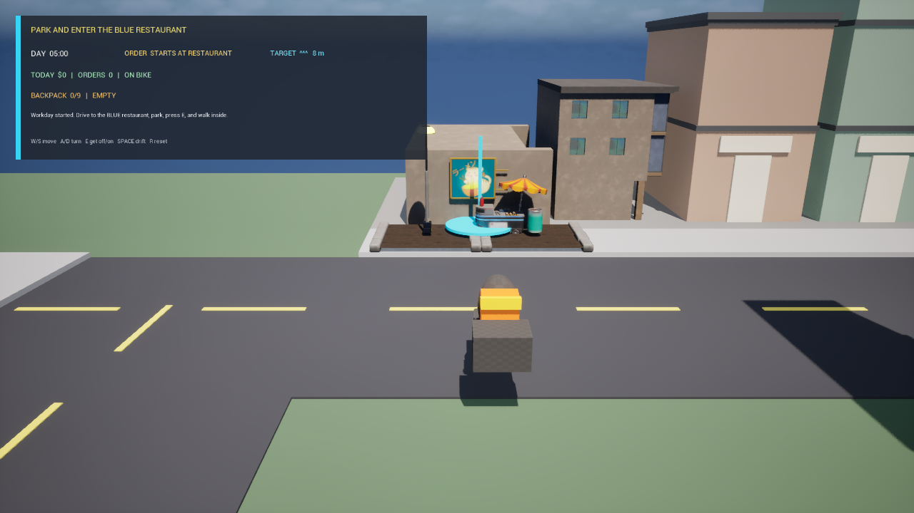
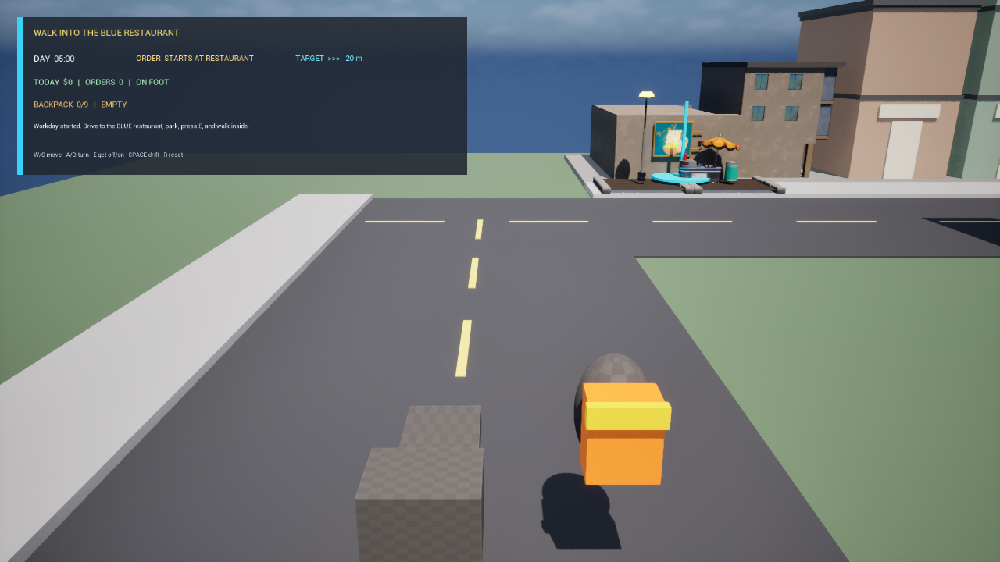
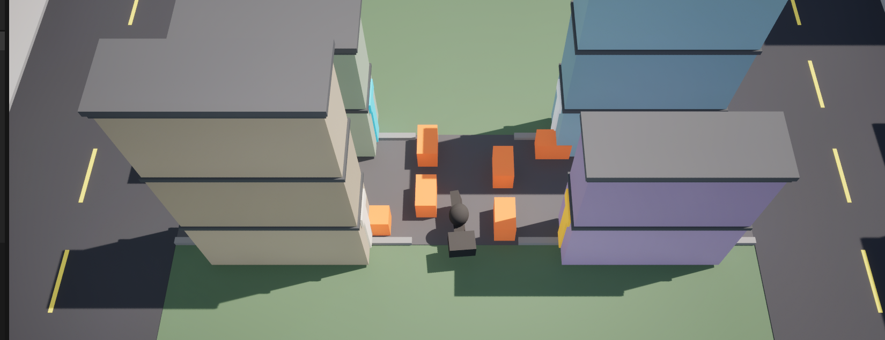

# 爆单骑手 / BaoDanRider

一款使用 Unreal Engine 5.5 与 C++ 制作的第三人称外卖骑手动作游戏原型。

玩家需要在有限的工作日内骑车赶往餐厅、停车下车、徒步进店接餐、装入外卖背包，再回到车上完成配送。项目当前重点不是堆砌内容，而是通过白盒试玩验证“驾驶是否好开、路线是否好读、接单配送是否形成连续压力”。

> 当前阶段：早期白盒原型。核心驾驶已经通过玩家手感验收；限时工作日、下车接餐和背包循环已完成实现与自动验证，正在等待完整玩家试玩验收。画面不代表最终美术质量。



## 项目概览

| 项目 | 内容 |
|---|---|
| 类型 | 第三人称外卖配送动作游戏 |
| 引擎 | Unreal Engine 5.5 |
| 核心实现 | C++；Blueprint 用于资源、表现和参数调节 |
| 操作参考 | 《GTA》《极限竞速：地平线》的易上手驾驶感 |
| 视觉目标 | 《胡闹厨房》式鲜明、夸张、轻喜剧风格 |
| 当前模式 | 单人、5 分钟工作日、连续接单赚钱 |
| 我的职责 | 系统策划、白盒关卡、Prompt/验收标准、AI 协作开发、试玩反馈、质量验证 |

## 核心玩法循环

`开始工作日 → 骑车到餐厅 → 停车下车 → 徒步进店接餐 → 自动装入背包 → 回车上车 → 配送 → 收入与评级 → 继续下一单 → 日终结算`

- 工作日有固定时限，目标是在下班前尽量多赚钱，而不是完成固定单数。
- 订单倒计时在玩家真正进入餐厅接到餐后才开始。
- 工作日结束后不再生成新订单；已经装入背包的最后一单允许送完。
- 配送结果根据时间、餐品状态等数据结算为 `S/A/B/C`，采用软失败设计。
- 原型背包为 `3 × 3` 共 9 格，当前餐品占 5 格；后续用于扩展装包和多订单策略。



## 从立项到优化：AI 辅助原型迭代方法

这个项目不是用一句“帮我做个游戏”让 AI 一次生成，而是把自然语言交流逐步优化成可执行、可检查的制作指令。整个过程由我负责玩法方向、审美判断、Prompt 约束和最终验收，AI 负责加速任务拆分、C++ 实现、重复检查和文档同步。

核心闭环始终保持为：

**描述目标 → 拆分任务 → 运行检查 → 反馈问题 → 优化 Prompt → 再次验证**

### 从模糊想法到可验收任务

| 阶段 | 最初的自然语言表达 | Prompt 优化重点 | 产出与验证 |
|---|---|---|---|
| 1. 立项收敛 | “画风推荐《胡闹厨房》，手感类似《GTA》《地平线》” | 通过多轮问题补齐核心循环、单局结构、失败方式、镜头、世界规模、成长和美术边界 | 形成系统策划案，锁定单人、软失败、紧凑城区、车后镜头和 `S/A/B/C` 评级 |
| 2. 白盒回档 | “楼层摆放存在大问题，回档为白盒，按商业化管线做” | 把“看起来不对”转成厘米制尺寸、固定层高、建筑占地、入口朝向、道路净宽和禁止提前铺美术等约束 | 生成可重复构建的白盒城区；先验收路线和碰撞，再允许美术替换 |
| 3. 驾驶优化 | “如图位置卡死；撞墙镜头突然前移；改回车后方第三人称” | 加入截图与复现位置；拆开关卡碰撞、镜头行为和操控参数；要求保留已正常部分并逐项复测 | 拓宽中心捷径、移除阻挡、关闭白盒镜头缩臂、分轮调整转向；玩家确认三项均正常 |
| 4. 循环重构 | “背包没做；主角要下车去餐厅接单；一局应该是一整天” | 从三个体验意见推导角色状态、订单状态、计时起点、背包容量、上下车距离、日终边界和 HUD 验收项 | 重构为“停车下车 → 进店接餐 → 装包 → 上车配送 → 限时赚钱”，并通过编译、地图检查和 5 项自动测试 |
| 5. 美术决策 | “美术特效应该在哪个阶段做？” | 明确阶段门：白盒通过后只做一个样板，不把“有资源”误当成“风格通过” | 审计 372 个模型；发现素材偏灰写实后冻结批量铺设，避免在错误方向上继续投入 |

这张表展示的不是“AI 生成了多少代码”，而是我如何通过交流不断减少歧义：先把感受说清楚，再补充边界和验收标准，最后用实际运行结果决定下一轮 Prompt。

### 一次真实的 Prompt 优化

玩家反馈最初只有三句：

> 这个位置卡死；撞墙镜头会突然前移；手感不佳，改回车后方第三人称。

这类反馈对体验判断已经足够明确，但直接交给 AI 容易同时改动过多系统。因此我将它整理成下面这种执行 Prompt：

```text
[目标]
恢复稳定的车后第三人称驾驶体验。

[问题与复现]
1. 截图所示中心通道会卡住车辆。
2. 车辆撞墙时镜头突然向前缩。
3. 当前镜头构图和转向反馈不符合预期。

[必须保留]
已可用的加速、刹车、倒车、漂移和订单系统不得被破坏。

[任务拆分]
先检查通道净宽与碰撞体，再检查镜头缩臂，最后单独调整转向参数。
每解决一类问题就重新编译和运行，不把三类修改混成一次猜测。

[验收标准]
同一位置可以正向和倒车脱困；撞墙镜头不前冲；
车后视角稳定；玩家实际复测后确认转向速度。

[验证]
完整 Editor Build → 地图运行检查 → 截图/试玩 → 玩家反馈 → 再调参。
```

优化后的 Prompt 增加了五种关键信息：**复现条件、修改顺序、保护范围、验收标准、验证方式**。这样 AI 不只是“尝试修一下”，而是按可追踪的制作流程工作。



### Prompt 如何随反馈继续收敛

第一轮修复后，我没有继续追加模糊要求，而是用最短反馈逐项锁定状态：

1. “无卡死，镜头正常，转向偏慢”——说明关卡和镜头通过，只允许继续改转向。
2. 调整低速转向、高速转向比例和输入响应后重新编译。
3. “转向正常”——驾驶基线正式锁定，停止无目标调参。

这种方式把 Prompt 从“大改手感”收敛为“只改当前未通过的一项”，减少 AI 误改已通过功能的风险。

### 核心循环被推翻时如何处理

初版“自动取餐 → 配送 → 单笔结算”虽然可以运行，但不符合最终玩法。我没有在旧循环上继续堆 UI 和美术，而是明确提出三个体验缺口：可见背包、下车进店、一局是一整个工作日。

随后把交流内容改写为状态和边界条件：

- 只有停车后才能下车；下车后车辆留在原地；
- 必须徒步进入餐厅区域才算接到餐；
- 单笔订单倒计时从接到餐开始，而不是工作日开始就消耗；
- 背包必须可见，并显示 `5/9` 的占用状态；
- 工作日结束后停止发新单，但允许送完背包中的最后一单；
- 每次实现后必须同步 HUD、触发区、自动测试和项目文档。

这一步体现了 Prompt 优化的另一条原则：**方向错误时不要求 AI 小修小补，而是重新描述玩家行为链和系统边界，再进行结构性重构。**

### 我的 Prompt 编写原则

1. **先写玩家体验，再写功能名称**：先说明“玩家应该感觉到什么”，避免 AI 只完成表面按钮或变量。
2. **区分必须修改、必须保留和暂时不做**：控制改动范围，保护已经验收的系统。
3. **把主观反馈转成可复现问题**：附截图、位置、操作步骤、实际结果与期望结果。
4. **一次只锁定一组变量**：卡死、镜头、转向分开验证，避免无法判断是哪次修改生效。
5. **为边界情况写规则**：例如工作日到时、背包已有餐、重复进入触发区、重复结算。
6. **要求提供验证证据**：完整编译、地图冒烟、自动测试和玩家复测至少覆盖对应风险。
7. **通过后立即记录并冻结**：同步策划案和项目状态，避免下一轮 AI 忘记已经确认的结论。

<details>
<summary><strong>可复用的 AI 游戏原型 Prompt 模板</strong></summary>

```text
[体验目标]
玩家最终应该看到什么、做什么、感受到什么？

[当前状态]
哪些功能已经正常？本轮从哪个版本继续？

[问题与复现]
在哪里、做什么操作、实际发生什么、期望发生什么？

[本轮范围]
需要拆成哪些独立任务？优先顺序是什么？

[保护项]
哪些已通过内容不能改变？

[暂不处理]
本轮明确不做哪些美术、系统或扩展内容？

[验收标准]
什么现象出现才算完成？最好使用可观察或可测量的描述。

[验证要求]
编译、自动测试、地图运行、截图和玩家试玩分别检查什么？

[交付记录]
更新哪些策划、状态文档和下一步任务？
```

</details>

最终形成的方法不是“写一条完美 Prompt”，而是让 Prompt 和可运行原型共同演进：**每一轮交流都有目标，每一次修改都有证据，每一个通过项都能被下一轮安全继承。**

## 实现与验证

已完成的主要系统：

- 车辆加速、刹车后倒车、转向、漂移、碰撞恢复与复位；
- 车后第三人称跟随镜头及可调参数；
- 上下车、徒步移动、停放车辆和可见外卖背包；
- 餐厅接单、配送触发、订单计时、收入与 `S/A/B/C` 评级；
- 5 分钟工作日、连续订单、最后一单保护和日终总结；
- 9 格背包数据、升级/存档基础、数据表结构和原型配置；
- 白盒城区、道路捷径、任务标记和状态 HUD。

截至 2026-07-13 的验证记录：

- `BaoDanRiderEditor Win64 Development` 完整编译通过；
- `DeliveryCity` 地图加载与运行冒烟测试通过；
- 5 项核心自动测试通过：订单计时、配送状态、结算规则、存档往返、背包容量；
- 372 个导入静态模型完成尺寸审计，并据此停止不合适的高楼资产批量铺设；
- 驾驶、镜头和中心路线经过实际玩家反馈与复测确认。

## 为什么先做白盒

项目按商业游戏常用的阶段门推进：

1. 白盒验证道路、比例、碰撞和手感；
2. 锁定完整工作日玩法循环；
3. 只制作一个代表性美术样板街；
4. 样板通过后再批量替换城市资源；
5. 最后补充动画、特效、音频和性能优化。

首轮美术兼容样板证明导入资源可以落地，但整体偏灰、偏写实，不符合《胡闹厨房》式目标。因此没有继续铺满城市，而是冻结美术扩建并优先修正玩法循环。这也是本项目对开发成本和返工风险的主动控制。

## 操作方式

| 按键 | 功能 |
|---|---|
| `W / S` | 前进、刹车与倒车；徒步时前后移动 |
| `A / D` | 转向；徒步时转身 |
| `Space` | 漂移 |
| `E` | 停车下车 / 靠近车辆上车 |
| `R` | 工作日中复位 / 日终后开始新一天 |

## 工程结构

```text
Source/BaoDanRider/
├─ Core/          工作日、订单、结算、存档与升级
├─ Player/        骑手、车辆、镜头、上下车与徒步
├─ Cargo/         背包网格与容量
├─ Interaction/   餐厅接单区与配送区
├─ World/         白盒城区与美术兼容样板
├─ UI/            原型 HUD
└─ Tests/         UE 自动化测试

Docs/
├─ GameDesign.md       系统策划案
├─ ProjectStatus.md    当前进度与验证记录
└─ VisualBenchmark.md 美术样板与资产审计结论
```

## 本地运行

环境要求：Unreal Engine 5.5、Visual Studio 2022（安装“使用 C++ 的游戏开发”工作负载）。

1. 双击 `BaoDanRider.uproject`。
2. 按提示重新生成并编译 C++ 模块。
3. 打开 `/Game/Maps/DeliveryCity`，点击“运行”。

完整编译命令：

```powershell
$EngineRoot = 'D:\UE_5.5'
$Project = (Resolve-Path '.\BaoDanRider.uproject').Path
& "$EngineRoot\Engine\Build\BatchFiles\Build.bat" BaoDanRiderEditor Win64 Development "-Project=$Project" -WaitMutex -NoHotReloadFromIDE
```

仓库中的第三方示例素材不作为本人原创成果，也不随公开源码重复分发；缺失素材时以白盒内容为准。完整试玩包和演示视频将在核心循环验收后整理到 Releases。

## 下一步

- 完成整段工作日玩家验收与节奏调参；
- 加入日终升级购买和第二天存档继续；
- 制作符合目标画风的单个美术样板街；
- 加入取餐、送达、碰撞和漂移四类核心反馈；
- 核心玩法稳定后再增加车辆、行人和更多商家。

## 文档

- [系统策划案](Docs/GameDesign.md)
- [项目状态与验证记录](Docs/ProjectStatus.md)
- [视觉样板与资产审计](Docs/VisualBenchmark.md)

---

本项目使用 AI 辅助代码实现、测试编排和文档维护；玩法方向、任务拆分、试玩反馈、审美判断和最终验收由我负责。
